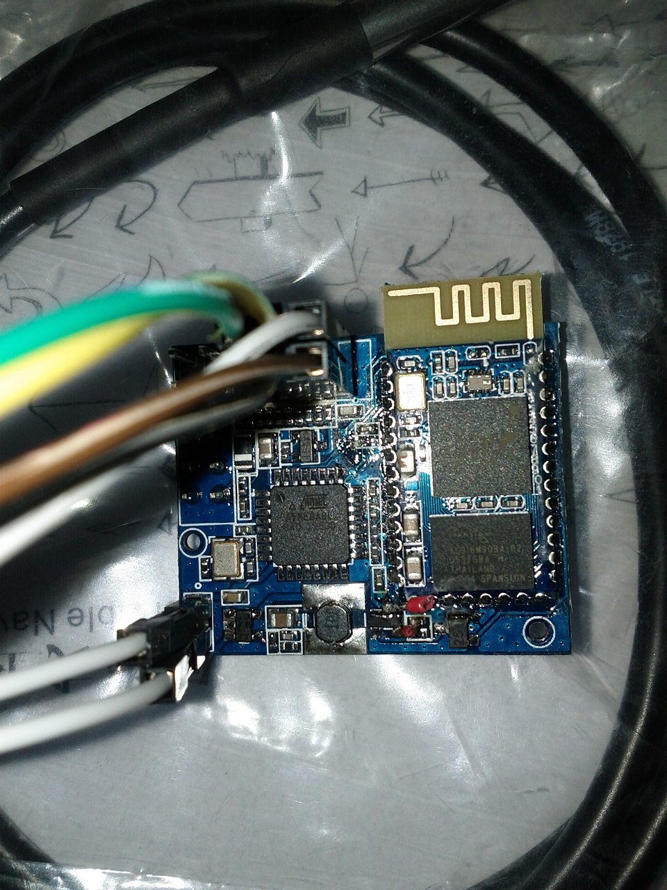

# RemoteIR: Universal Remote Control
----
## 说明  
虽然智能家居的概念很早就提出了，但在国内，这一概念大约7、8年前才开始普及。那个时候几乎找不到带红外遥控的手机，于是我们做了一个小玩意--用手机控制的万能遥控器，算是对智能家居应用的一个小尝试。

这份资料是整理硬盘时发现的，把它放在这里，或许还有人能用得到。对于做嵌入式的人来说，代码中的红外编解码部分可能会有再利用的价值。  
资料包括源代码（手机端与设备端）、电路图和简单的调试记录。
## 功能
手机通过蓝牙连接设备，给设备发送遥控码，设备通过红外发射器将遥控码发送出去，从而控制各种家电。
设备与手机是双向通讯的，所以手机可以通过设备学习其它遥控器的遥控码。

现在来看，这又是一个有意思但没太多用处的小玩意:D 

## 目录结构
Code\android：Android手机端应用。   
Code\device_atmega8：设备端代码，使用atmega8L作为MCU。  
Schematic：硬件设计原理图。   
Doc：部分文档。

